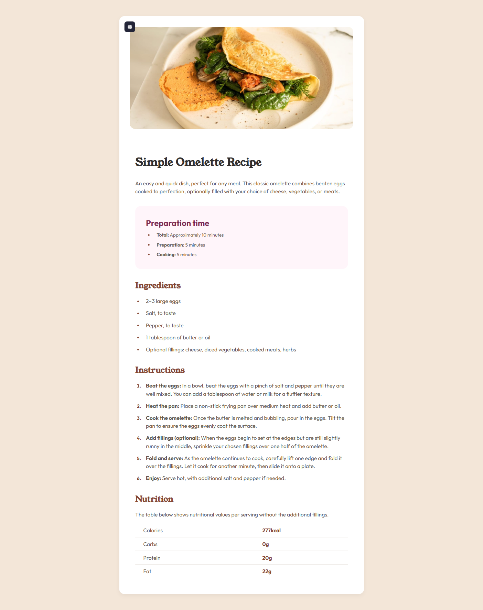

# Frontend Mentor - Recipe Page Solution

This repository contains my solution to the [Recipe Page challenge on Frontend Mentor](https://www.frontendmentor.io/challenges/recipe-page-KiTsR8QQKm).  
Frontend Mentor challenges provide realistic front-end projects that help developers improve their skills in HTML, CSS, and modern workflow tools.

---

## Overview

### Welcome! 👋
Thank you for visiting my solution. This project demonstrates a **responsive, mobile-first recipe page** built with **semantic HTML5** and **modern CSS techniques using Sass**.

### Screenshot

### Links
- **Solution URL:** [solution URL here](https://github.com/saramx-dev/Recipe-page)
- **Live Site:** [live site URL here](https://saramx-dev.github.io/Recipe-page/)

---

## My Process

### Built With
- Semantic HTML5 markup
- **Sass (SCSS) for modular and maintainable CSS**
- CSS custom properties and variables
- CSS Grid and Flexbox for layout
- Mobile-first responsive design approach
- Modern workflow with partials, mixins, and functions

### What I Learned
This project helped me improve in several areas:
- Writing **modular and reusable CSS** using Sass (partials, mixins, functions)
- Building responsive layouts using **CSS Grid** and **Flexbox**
- Implementing **fluid typography** with Sass functions
- Structuring a project using **mobile-first workflow**

### Continued Development
In future iterations, I plan to:
- Implement a using Sass and CSS variables
- Using **design tokens** (colors, spacing, typography) for maintainability.

### Useful Resources
- [Sass Official Documentation](https://sass-lang.com/documentation) – for mastering Sass workflow
- and other internet resources.

---

## Author
- **Frontend Mentor:** [@saramx-dev](https://www.frontendmentor.io/profile/saramx-dev)  
- **Twitter:** [@saramx_dev](https://x.com/saramx_dev)  
- **LinkedIn:** [Sara Mohamed](https://www.linkedin.com/in/saramx-dev/)  

---

## Acknowledgments
Thanks to the Frontend Mentor team and community for providing practical challenges that make front-end development both educational and enjoyable.
